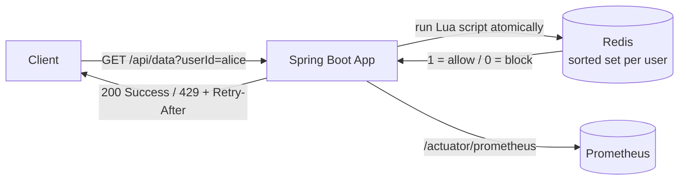

# Distributed API Rate Limiter

A production-style API rate limiter built with **Spring Boot** and **Redis**, using a
**sliding-window-log** algorithm enforced **atomically via a Lua script**. It caps how
many requests a given user may make inside a time window and returns
`429 Too Many Requests` (with a `Retry-After` header) once the limit is exceeded.

Because all state lives in Redis, the limiter works correctly across **many application
instances** — a single shared counter, not one-per-server.

---

## Why this project is interesting

| Concern | How it's solved |
| --- | --- |
| **Concurrency / race conditions** | The check-and-record step runs as a single **atomic Lua script** inside Redis, so two simultaneous requests can never both slip past the limit. |
| **Works across multiple instances** | State is stored in **shared Redis**, so horizontal scaling doesn't multiply the effective limit. |
| **Accurate counting** | A **sliding-window log** (Redis sorted set keyed by timestamp) avoids the boundary-burst problem of fixed windows. |
| **Configurable** | Limit and window are externalised via validated `@ConfigurationProperties` — change them in `application.yaml`, no recompile. |
| **Observable** | Allowed/blocked decisions are exported as **Micrometer + Prometheus** metrics. |
| **Self-cleaning** | Idle keys auto-expire via Redis `PEXPIRE`, so memory doesn't grow unbounded. |

---

## Architecture



Plain-text view of a single request:

```
Client ── GET /api/data?userId=alice ──▶ ApiController
                                              │
                                              ▼
                                RateLimiterService.isAllowed(userId, limit, windowMs)
                                              │  sends now, window, limit
                                              ▼
                              Redis runs rate-limiter.lua  ◀── ATOMIC
                                              │  returns 1 (allow) or 0 (block)
                                              ▼
                       1 → 200 "Success"   /   0 → 429 "Too Many Requests" (+ Retry-After)
                                              │
                                              ▼
                          metrics counter++ → scraped by Prometheus
```

---

## How the algorithm works

Each user gets a Redis **sorted set** at key `rate_limit:<userId>`. Every request is
stored as an entry whose **score is its timestamp**. On each call the Lua script
([`rate-limiter.lua`](src/main/resources/lua/rate-limiter.lua)) does, atomically:

1. `ZREMRANGEBYSCORE` — drop entries older than `now - window` (slide the window forward).
2. `ZCARD` — count what remains inside the window.
3. If `count >= limit` → return `0` (**blocked**, request is *not* recorded).
4. Otherwise `ZADD` this request, refresh TTL with `PEXPIRE`, return `1` (**allowed**).

Running steps 2–4 as one indivisible Redis operation is what makes it correct under
concurrent load — there is no gap between "count" and "record" for another request to
exploit.

---

## Tech stack

- Java 17, Spring Boot
- Spring Data Redis (Lua scripting via `DefaultRedisScript`)
- Spring Boot Actuator + Micrometer + Prometheus (metrics)
- Bean Validation (`@Validated` config)
- JUnit 5 + Mockito (tests)
- Docker Compose (Redis + Prometheus)

---

## Running it locally

**Prerequisites:** Docker, JDK 17.

1. Start Redis and Prometheus:
   ```bash
   docker compose up -d
   ```
2. Start the application (defaults to port 8080):
   ```bash
   ./mvnw spring-boot:run
   ```
3. Hit the endpoint. The default policy is **5 requests / 10 seconds**:
   ```bash
   # 6 quick calls: first 5 succeed, the 6th is rejected
   for i in $(seq 1 6); do curl -i "http://localhost:8080/api/data?userId=alice"; done
   ```
   The 6th response returns `HTTP 429` with a `Retry-After: 10` header.

### Inspect the counter in Redis

```bash
docker compose exec redis redis-cli ZCARD rate_limit:alice      # current count in window
docker compose exec redis redis-cli ZRANGE rate_limit:alice 0 -1 WITHSCORES  # raw timestamps
```

### Metrics

- App metrics: <http://localhost:8080/actuator/prometheus> (look for `rate_limiter_allowed` / `rate_limiter_blocked`)
- Prometheus UI: <http://localhost:9090>

---

## Configuration

Set in [`application.yaml`](src/main/resources/application.yaml) (or override via env vars /
command-line args). Values are validated at startup — a non-positive value stops the app
from booting rather than silently misbehaving.

```yaml
rate-limiter:
  limit: 5         # max requests per window
  window-ms: 10000 # window length in milliseconds
```

Override without editing the file:

```bash
./mvnw spring-boot:run "-Dspring-boot.run.arguments=--rate-limiter.limit=100 --rate-limiter.window-ms=60000"
```

---

## Tests

```bash
./mvnw test
```

Covers the service decision logic (allow / block / null-safety) and the controller's
`200` and `429`-with-`Retry-After` responses.

---

## Known limitations & next steps

This is a focused demo; in a real deployment I would:

- **Derive identity from auth, not a query param.** `userId` is currently a request
  parameter for easy demoing; production should key on a JWT subject, API key, or client IP.
- **Apply it centrally at an API gateway** (e.g. Spring Cloud Gateway's reactive Redis
  rate limiter) so every microservice is protected without per-service code.
- **Decide fail-open vs fail-closed** behaviour if Redis is unavailable.
- **Support per-endpoint / per-tier limits** (e.g. strict on `/login`, loose on reads).
